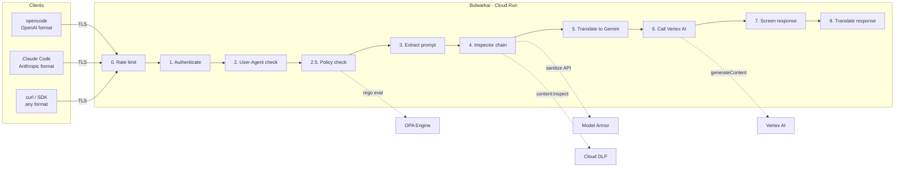
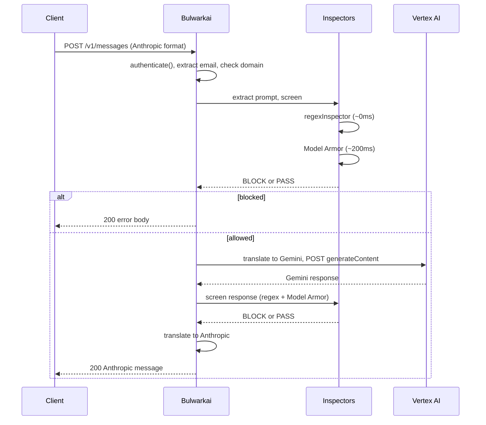
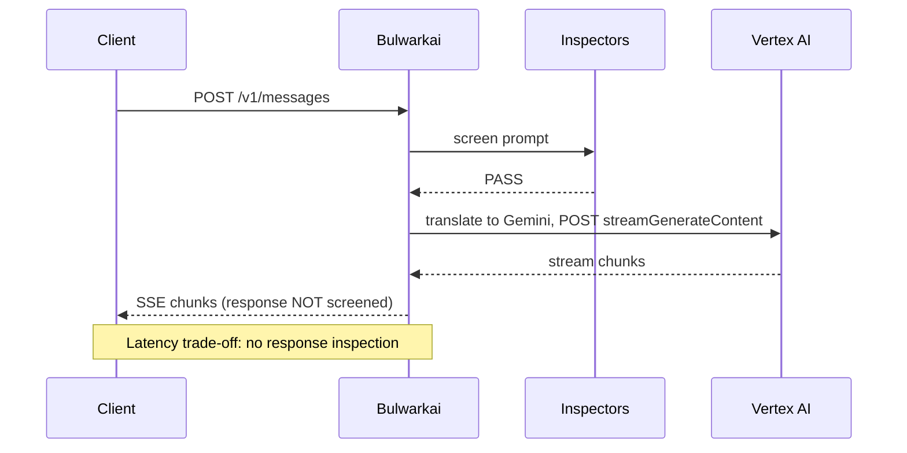
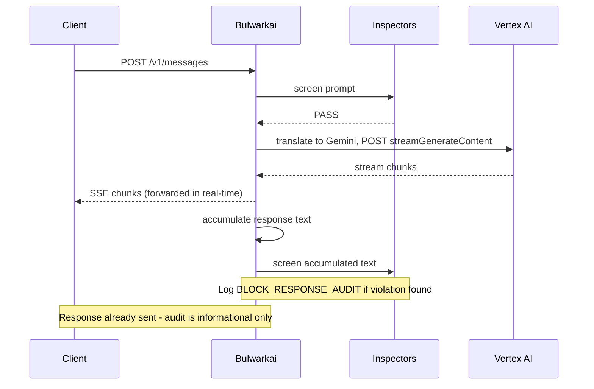

# Design and Architecture

## Architecture

Tokens: `Authorization: Bearer <OIDC identity token>`, `X-Forwarded-Access-Token: <OAuth access token>`

### Request flow (strict mode)

### Request flow (fast mode)

### Request flow (audit mode)

## Response Modes

The service has three operating modes, controlled by the `RESPONSE_MODE` environment variable.

### strict (default)

Non-streaming only. The service calls Vertex AI's `generateContent` endpoint (no streaming), waits for the full response, screens both prompt and response through all inspectors, then returns the result. Streaming requests get converted to fake SSE by sending the complete response as a single chunk.

This is the only mode where Model Armor's built-in Vertex AI enforcement works correctly (there is a known gap where Model Armor does not enforce on streaming endpoints).

### fast (alias: input_only)

Real streaming. Prompt-only inspection. The service calls `streamGenerateContent` and proxies chunks to the client immediately. Response content is not inspected. Use this when latency matters more than response screening.

### audit (alias: buffer)

Real streaming with post-response audit. Chunks stream to the client in real time, but the service accumulates the full text. After the stream completes, it runs response inspectors on the accumulated text and logs any violations. The response has already been sent, so the audit is informational only.

## Authentication

The service accepts two authentication methods:

1. **JWT Bearer Token**: The `Authorization: Bearer <token>` header. The service extracts the email from the JWT payload and checks it against the domain allowlist. If `X-Forwarded-Access-Token` is present, that token is used for Vertex AI calls instead of the bearer token (which is an OIDC identity token, not an OAuth access token).

2. **API Key**: The `X-Api-Key` header. Validated against the `API_KEYS` environment variable. API key requests use `apikey@<first-allowed-domain>` as the identity.

All authentication requires the email domain to be in `ALLOWED_DOMAINS`.

## Policy Engine (OPA)

When enabled via `OPA_ENABLED=true`, an embedded Open Policy Agent evaluates access control decisions after authentication but before content inspection. The policy engine receives the caller email, requested model, streaming flag, and request path. It never sees prompt or response text.

The policy is loaded at startup from `OPA_POLICY_FILE` (file path on disk) or `OPA_POLICY_URL` (HTTP URL or inline Rego content). If neither is set, a permissive default policy (`allow := true`) is used.

Evaluation is synchronous and in-process using the `rego` package. A typical policy evaluation takes under 100 microseconds. On evaluation errors, the engine fails open and logs the error.

Pipeline position: auth, then policy engine, then inspector chain, then Vertex AI.

### Policy Hot-Reload

When `OPA_POLICY_FILE` is set, the engine polls the file every 5 seconds. When the file's modification time changes, the new content is compiled and swapped in atomically using a read-write lock. If the new policy fails to compile, the old policy remains active and an error is logged. This prevents a syntax error from blocking all traffic.

When `OPA_POLICY_URL` is set to an HTTP(S) URL, the engine polls the URL every 30 seconds. If the response is a valid Rego policy, it replaces the current policy. Non-2xx responses and compilation errors are logged and the existing policy is preserved.

### Policy Loading Sources

`OPA_POLICY_FILE`: local file system path. The file is read once at startup, then polled for changes.

`OPA_POLICY_URL`: three modes:
1. HTTP(S) URL: fetched at startup, then polled for changes. Works with GCS signed URLs, S3 presigned URLs, or any HTTP endpoint that serves Rego content.
2. Non-URL string: compiled directly as inline Rego content at startup. No hot-reload.
3. Empty: falls back to the default permissive policy.

## Rate Limiting

When `RATE_LIMIT` is set to a value greater than 0, a fixed-window rate limiter enforces per-user request limits. The limit applies per email address, using the identity resolved during authentication. API key requests share the `apikey@<domain>` identity.

Expired windows are cleaned up periodically. The implementation uses a sync.Mutex with a map of counters. This is sufficient for a single-instance Cloud Run deployment. For multi-instance deployments, an external rate limiting store (Redis, Memcached) would be needed.

Rate-limited requests receive HTTP 429 and are logged. The rate limiter is wired into the HTTP middleware chain before authentication, so it applies to all requests including those that would fail auth. The `bulwarkai_rate_limit_exceeded_total{email}` metric tracks rejections per user.

## Webhook Notifications

When `WEBHOOK_URL` is set, every BLOCK and DENY event triggers an asynchronous HTTP POST to the configured URL. The payload is a JSON object containing the event timestamp, action type, model name, user email, block reason, request ID, and (redacted) prompt text.

Notifications are sent from a buffered queue (256 events). If the queue is full, events are dropped and a warning is logged. This prevents webhook backpressure from affecting request processing latency.

The webhook client sets a `Content-Type: application/json` header and optionally an `X-Webhook-Secret` header (when `WEBHOOK_SECRET` is configured). The client has a 10-second timeout per request. Server errors (5xx) and network errors trigger up to 3 retries with exponential backoff (500ms base, 2x factor, 10s cap). Client errors (4xx) are not retried.

## Circuit Breaker

The Vertex AI client wraps all outbound calls in a circuit breaker. When 5 consecutive calls fail (network error, timeout, or non-200 response), the breaker opens. Open-circuit requests are rejected immediately with a clear error, skipping JSON parsing, inspector evaluation, and the HTTP round-trip.

After 30 seconds in the open state, the breaker transitions to half-open and allows a single probe request. A successful probe closes the circuit. A failed probe reopens it.

The breaker state is exposed in the `/health` endpoint (`circuit_breaker` field) and as the `bulwarkai_circuit_breaker_state` Prometheus gauge. The state values are: 1 (closed), 0.5 (half-open), 0 (open).

## CORS

## CORS

When `CORS_ORIGIN` is set, the service adds `Access-Control-Allow-Origin` and related headers to all responses. OPTIONS preflight requests receive a 204 No Content response with `Access-Control-Allow-Methods`, `Access-Control-Allow-Headers`, and `Access-Control-Max-Age` headers.

## Request Flow

### Anthropic Messages API (`POST /v1/messages`)

Receives Anthropic-format requests (`messages` array with `role`/`content`, `system` as top-level field, `max_tokens`). Converts to Gemini's `contents` array with system instruction injection (system prompt becomes a user/model turn pair). Returns Anthropic-format responses with `msg_` prefixed IDs and `stop_reason` mapped from Gemini's `finishReason`.

### OpenAI Chat Completions (`POST /v1/chat/completions`)

Receives OpenAI-format requests. Extracts `system` role messages and passes them as the system instruction. Returns OpenAI-format responses with `chatcmpl-` prefixed IDs and `finish_reason` mapped from Gemini's `finishReason`.

### Vertex AI Compat (`/models/:model:action`, `/v1/projects/:project/...`)

Pass-through for native Gemini format requests. Also supports Anthropic-format bodies (detected by `anthropic_version` field) which get translated to Gemini before forwarding.

## Streaming

For streaming requests (`stream: true` in the request body), the service handles SSE formatting:

Anthropic streaming emits: `message_start`, `content_block_start`, `content_block_delta` (per text chunk), `content_block_stop`, `message_delta`, `message_stop`.

OpenAI streaming emits: `chat.completion.chunk` objects with role delta, content deltas, and a final chunk with `finish_reason`, terminated by `[DONE]`.

The `parseGeminiChunk` function handles Vertex AI's streaming format, which arrives as a JSON array `[{},\n{},\n{}]` or as individual JSON objects separated by newlines.

## Configuration

All configuration is through environment variables.

| Variable | Default | Description |
|---|---|---|
| `GOOGLE_CLOUD_PROJECT` | `YOUR_PROJECT_ID` | GCP project ID |
| `GOOGLE_CLOUD_LOCATION` | `europe-west2` | GCP region |
| `ALLOWED_DOMAINS` | (none) | Comma-separated email domain allowlist |
| `FALLBACK_GEMINI_MODEL` | `gemini-2.5-flash` | Model used when request doesn't specify one |
| `RESPONSE_MODE` | `strict` | `strict`, `fast` (alias: `input_only`), or `audit` (alias: `buffer`) |
| `MODEL_ARMOR_TEMPLATE` | `test-template` | Model Armor template name |
| `MODEL_ARMOR_LOCATION` | `europe-west2` | Model Armor location |
| `API_KEYS` | (empty) | Comma-separated valid API keys |
| `USER_AGENT_REGEX` | (empty) | Regex pattern for User-Agent enforcement |
| `DLP_API` | (empty) | Set to `true` to enable DLP inspector |
| `DLP_INFO_TYPES` | `US_SOCIAL_SECURITY_NUMBER,CREDIT_CARD_NUMBER,...` | DLP info types to detect |
| `DLP_MIN_LIKELIHOOD` | `LIKELY` | Minimum DLP finding likelihood |
| `DLP_LOCATION` | (uses `GOOGLE_CLOUD_LOCATION`) | DLP API location |
| `OPA_ENABLED` | (empty) | Set to `true` to enable the OPA policy engine |
| `OPA_POLICY_FILE` | (empty) | Path to a Rego policy file on disk (hot-reloaded) |
| `OPA_POLICY_URL` | (empty) | HTTP URL or inline Rego policy content (URL polled every 30s) |
| `RATE_LIMIT` | `0` | Per-user request limit per window (0 to disable) |
| `RATE_LIMIT_WINDOW` | `1m` | Rate limit time window (Go duration) |
| `WEBHOOK_URL` | (empty) | URL for block event notifications |
| `WEBHOOK_SECRET` | (empty) | Secret token for webhook verification |
| `CORS_ORIGIN` | (empty) | Access-Control-Allow-Origin value. Empty disables CORS. |
| `PORT` | `8080` | HTTP listen port |
| `LOG_LEVEL` | `info` | Log level (`info` or `debug`) |
| `LOG_PROMPT_MODE` | `truncate` | How prompts appear in logs: `truncate` (first 32 chars), `hash` (SHA-256 prefix), `full`, `none` |
| `LOCAL_MODE` | (empty) | Set to `true` for local dev (skips auth, uses ADC) |

## Design Decisions

### Why Go

The first version was Node.js. It worked for prototyping but the runtime overhead was wrong for a security proxy: V8 startup time, loose error handling in async chains, and a dependency tree that made supply-chain audits painful. Go gives a single static binary, explicit error handling, and no runtime dependencies beyond the OS kernel. The `scratch` Docker image is 7MB. Cold start on Cloud Run is under a second.

### Why a Proxy, Not a Library

The Bulwarkai could have been a shared library that each client application imports. That approach has two problems. First, every client must integrate the library correctly, and a misconfigured client bypasses all screening. Second, library updates require every consumer to rebuild and redeploy. A proxy centralises enforcement at the network level: no client can reach Vertex AI without passing through the service, regardless of how they are configured.

This matters for a security control. The enforcement point needs to be outside the client's control.

### Why Cloud Run

Cloud Run is the only Google Cloud serverless option that supports request streaming, IAM-based authentication, and VPC connector attachment in a single service. Cloud Functions does not support bidirectional streaming. GKE would work but adds operational overhead for a single service.

If your org policy blocks `allUsers` and `allAuthenticatedUsers` on Cloud Run services, access is restricted to IAM principal-based invocations. Clients must present a valid Google identity token.

### Why Three API Formats

opencode uses the OpenAI Chat Completions format. Claude Code uses the Anthropic Messages API. Some internal tools call Vertex AI directly. Rather than forcing every client through one format, the service accepts all three and translates internally. This avoids forcing client-side changes when rolling out the proxy.

### Why User Tokens All the Way Through

The service could use a service account to call Vertex AI, which would be simpler to configure. Instead, it forwards the user's OAuth access token. This means Vertex AI audit logs show which human made each request, not which service account. Auditability of who asked the model what is a hard requirement for many organisations.

The two-token design (OIDC identity token in `Authorization`, OAuth access token in `X-Forwarded-Access-Token`) exists because Cloud Run IAM requires an OIDC identity token for invocation, while Vertex AI requires an OAuth access token. A single OAuth request with scope `cloud-platform openid email` returns both.

### Why Inspector Chain, Not Single Inspector

Different screening tools have different strengths. Regex catches known patterns (SSNs, credit cards, private keys) with zero latency and no external dependency. Model Armor catches semantic violations (harmful content, prompt injection) that regex cannot. DLP catches structured data leakage with statistical confidence scores. Running them as a chain means each inspector does one job well, and new inspectors can be added without modifying existing ones.

The chain stops on the first block. This is deliberate: if regex catches an SSN, there is no point also calling Model Armor.

### Why Fail-Open on Inspector Errors (Application Layer)

If Model Armor or DLP returns an error (network timeout, 500, auth failure), the inspector returns nil (pass). The alternative is fail-closed, which would block all traffic when an external dependency has an outage.

For this service, blocking all AI access because DLP is down would cause more harm than letting a request through unscreened. The `strict` mode provides a safety net: Model Armor's Vertex AI integration enforces independently of the inspector chain on `generateContent` calls. Fail-open applies to the inspector layer, not to the entire control plane.

The Terraform configuration overrides this at the platform level. Setting `ignore_partial_invocation_failures = false` on the Model Armor template means the platform itself fails closed when Model Armor is unavailable, independently of what the application-layer inspector does. This gives two independent fail-closed guarantees: the application returns errors in strict mode, and the platform rejects the call at the Vertex AI integration layer.

### Why `scratch` for Docker Runtime

The binary is compiled with `CGO_ENABLED=0` and static linking flags (`-ldflags="-s -w"`). There is no reason to include an OS in the runtime image. `scratch` contains nothing but the binary and the TLS root certificates copied from the builder stage. This removes an entire class of container vulnerability (OS package CVEs) and reduces the image to 7MB.

### Why Not Cloud Build

If your organisation policy `constraints/gcp.resourceLocations` restricts resource creation to EU regions, Cloud Build cannot be used because it creates temporary resources in the US regardless of where the source code lives. Local Docker builds pushed to Artifact Registry avoid this constraint.

## Security Approach

### Threat Model

The service defends against two categories of risk:

1. Data exfiltration: sensitive data (SSNs, credit card numbers, private keys, credentials) flowing into prompts or leaking out in model responses.
2. Content policy violations: harmful, abusive, or policy-violating content in either direction.

The service does not defend against a compromised Cloud Run instance, a malicious insider with project-level access, or a compromised Google infrastructure. Those threats require different controls (VPC Service Controls, org policies, audit log monitoring).

### Defence in Depth

Screening happens at three independent layers:

1. Inspector chain (application layer): regex, Model Armor standalone API, DLP. Runs on every request and response in `strict` mode.
2. Model Armor Vertex AI integration (platform layer): Google's built-in content safety on Vertex AI `generateContent` calls. Operates independently of the inspector chain. Only effective on non-streaming endpoints due to the known streaming gap. Configured to fail-closed when Model Armor is unavailable.
3. Structured audit logging (detection layer): every request, block, and allow event is logged with request ID, user identity, model, and reason. Supports post-incident investigation and compliance reporting.

Infrastructure controls provide additional isolation:

4. VPC Service Controls perimeter around Vertex AI, Model Armor, and DLP prevents direct access to these services outside the proxy.
5. Binary Authorization requires attestation before Cloud Run accepts a container image.
6. CMEK encryption on Artifact Registry and Cloud Run. Region-pinned Secret Manager replication.

### Identity and Access

Authentication follows a priority chain:

1. API key check against configured `API_KEYS` list.
2. Google OAuth tokeninfo call to resolve the bearer token to an email address.
3. JWT payload extraction as a fallback when tokeninfo is unreachable (the `extractEmailFromJWT` function parses the base64-encoded payload without signature verification).

JWT extraction without verification is an intentional trade-off. The service is not an identity provider; it trusts that Cloud Run IAM has already validated the token before the request reaches the application code. If Cloud Run IAM is bypassed, the entire security model is already compromised and JWT verification would add no meaningful protection.

All authenticated emails must match the `ALLOWED_DOMAINS` list. Requests from unknown domains get a 403 response and a `DENY_DOMAIN` log entry.

### Token Handling

The service never stores tokens. Bearer tokens are used for the duration of the request to resolve identity and call Vertex AI, then discarded. Tokens are not logged. The `X-Forwarded-Access-Token` is forwarded to Vertex AI in the `Authorization` header, not stored or cached.

### Inspector Fail-Open Semantics

When an inspector cannot reach its backend (Model Armor, DLP), it returns a `BlockResult` with the `Err` field set rather than blocking the request. This is a conscious decision: the cost of blocking all AI traffic during a DLP outage exceeds the cost of an unscreened request. The `strict` mode's use of non-streaming calls means Model Armor's Vertex AI integration still provides a baseline enforcement even when the standalone API is down. The OPA policy engine follows the same fail-open philosophy: a broken policy does not block all traffic.

Fail-open events are counted in `bulwarkai_inspector_results_total{result="error"}` and logged at ERROR level with the message `inspector error (fail-open)`. Alert on any non-zero rate for this metric.

The Terraform configuration (`ignore_partial_invocation_failures = false`) adds a platform-level fail-closed override. When Model Armor itself is unavailable, the Vertex AI integration rejects the call rather than skipping sanitization. This is separate from the application-layer inspector behavior.

### Logging and Audit

All events use structured JSON logging via `slog`. Each request carries:
- Request ID (from `X-Request-ID` header or auto-generated UUID)
- Trace ID (from `X-Cloud-Trace-Context` when present)
- User email
- Model name
- Action (`ALLOW`, `BLOCK_PROMPT`, `BLOCK_RESPONSE`, `BLOCK_RESPONSE_AUDIT`, `DENY_DOMAIN`, `DENY_UA`, `DENY_POLICY`)
- Block reason (when applicable)
- Duration in milliseconds

Block events log at `WARN` level. Allow events at `INFO`. Inspector fail-open errors at `ERROR`. Logs are emitted to stdout and collected by Cloud Logging.

### Metrics

The service exposes Prometheus metrics at `/metrics`. Three metric families cover the request lifecycle:

`bulwarkai_requests_total{action, model}` counts every completed request by outcome (allow, block, deny).

`bulwarkai_inspector_results_total{inspector, direction, result}` counts each inspector evaluation. The `result` label is `pass` (clean), `block` (violation found), or `error` (fail-open: the inspector could not evaluate). The `inspector` label is `regex`, `model_armor`, or `dlp`. The `direction` label is `prompt` or `response`.

`bulwarkai_policy_results_total{result}` counts OPA policy engine evaluations when enabled. The `result` label is `allow`, `deny`, or `error`.

Latency is tracked with `bulwarkai_request_duration_seconds{action}` for end-to-end requests and `bulwarkai_inspector_duration_seconds{inspector, direction}` for per-inspector timing. Active request count is available as `bulwarkai_active_requests`. Request body size is tracked with `bulwarkai_request_body_bytes`. Rate limit rejections are tracked with `bulwarkai_rate_limit_exceeded_total{email}`.

See `docs/operations.md` for PromQL alerting queries and dashboard layouts.

### Response Mode Security Properties

| Mode | Prompt Screened | Response Screened | Streaming | Model Armor Enforced |
|---|---|---|---|---|
| strict | yes (sync) | yes (sync) | fake (single chunk) | yes (via generateContent) |
| fast | yes (sync) | no | real | no (streaming bypass) |
| audit | yes (sync) | post-hoc audit only | real | no (streaming bypass) |

`strict` is the only mode that provides full synchronous screening of both directions. `fast` trades response screening for latency. `audit` provides informational audit logging without enforcement on responses.

### Supply Chain

The Go binary has direct dependencies on `google/uuid`, `anthropics/anthropic-sdk-go`, `openai/openai-go/v3` (the latter two for test-only SDK compliance checks), and `open-policy-agent/opa/rego` (for the embedded policy engine). The Docker runtime has zero OS packages. The attack surface for supply-chain compromise is the Go module proxy, the Artifact Registry, and Cloud Run itself.

### Network

The service runs in a Google-managed Cloud Run environment with Direct VPC Egress into a dedicated VPC and subnet. Outbound connections go to Vertex AI (`aiplatform.googleapis.com`), Model Armor (`modelarmor.europe-west2.rep.googleapis.com`), DLP (`dlp.googleapis.com`), and OAuth (`oauth2.googleapis.com`). All use HTTPS. No inbound connections are accepted other than through Cloud Run's load balancer, which is configured for internal-only ingress.

A VPC Service Controls perimeter restricts Vertex AI, Model Armor, and DLP to this project. An ingress rule allows the Cloud Run VPC to reach these services. The Bulwarkai service account is the only identity permitted to call Vertex AI within the perimeter, preventing users from bypassing the proxy.

Binary Authorization is enabled with an attestor, requiring signed container images before deployment. Artifact Registry and Cloud Run are both encrypted with CMEK keys. Secret Manager stores API keys with region-pinned replication and resource-level IAM bindings.

A VPC Service Controls perimeter around Vertex AI is planned but not yet deployed. Once in place, the Bulwarkai's service account will be the only identity permitted to call Vertex AI within the perimeter, preventing users from bypassing the proxy.
